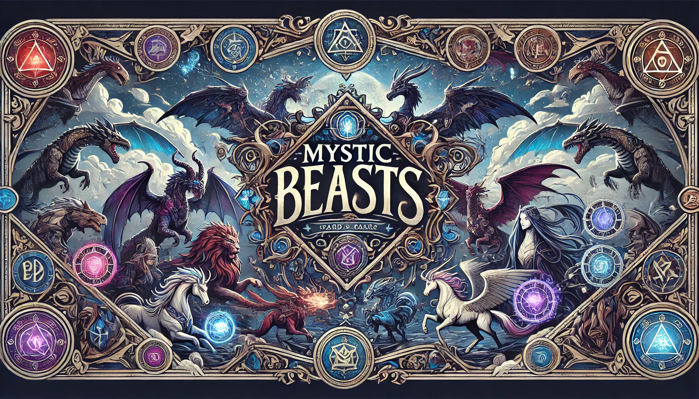
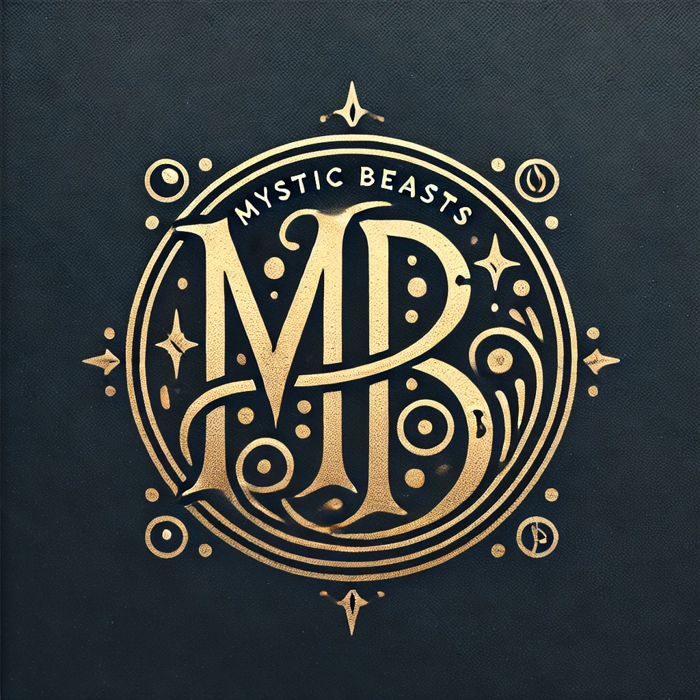

# Mystic Beasts

## Overview
Mystic Beasts is a card game featuring a collection of mythical creatures, each with unique attributes and powers. Players engage in strategic battles using cards that represent these creatures, drawing on their magical abilities to outmaneuver opponents.



## Educational Purpose
This project is designed purely for educational purposes. It serves as a demonstration of integrating various technologies such as NLP, Python, and modern web frameworks to create a full-stack application.

## Features
- **Interactive Gameplay**: Engage with a dynamic card game that tests strategy and planning.
- **Mythical Creatures**: Explore cards featuring a wide array of mystical beings with unique abilities.
- **NLP Integration**: Utilize natural language processing to interpret player inputs and provide game guidance.

## Technologies Used
- **Frontend**: Developed using [Gradio](https://gradio.app/) for an interactive, user-friendly interface.
- **Backend**: Powered by [FastAPI](https://fastapi.tiangolo.com/), handling game logic and NLP operations.
- **NLP**: Leveraging large language models for dynamic text interpretation and decision-making.

## Data Structure
- **Creatures Data**: The game's creature configurations are stored in JSON format in the `data/creatures` directory. These files define the attributes and abilities of each mythical creature used in the game.

- **Logo**: 

## Setup and Installation
To set up the project initially, run the provided batch file once after cloning the repository:

```bash
git clone https://yourrepositorylink.com/mysticbeasts.git
cd mysticbeasts
```

### Building and Running with Docker
After you have completed the initial setup, you can build and run the Docker container with the following commands:

```bash
REM Build the Docker image
docker build -t mysticbeasts -f docker\Dockerfile .

REM Run the Docker container
docker run -p 8000:8000 --name mystic_beasts_container mysticbeasts
```

Navigate to `http://localhost:8000` in your web browser to verify that the application is running correctly.

## Creatures JSON Structure
For detailed documentation on the JSON structure used to define each creature's attributes and abilities, see the [Creature JSON Structure Documentation](data/creatures/template.json) located in the `data/creatures` directory.

### Field Descriptions
- **creature_id**: A unique identifier for each creature.
- **name**: The name of the creature.
- **description**: Lore-based description providing background.
- **attributes**: Key statistics that define the creature's capabilities.
  - **strength**, **magic**, **agility**, **wisdom**: Attributes that influence battle performance.
- **abilities**: Special abilities with specific effects.
  - **ability_name**: Name of the ability.
  - **ability_description**: Description of what the ability does.
  - **ability_effect**: Detailed effects such as damage or healing.
- **image**: A URL to an image of the creature.
- **card_image**: A URL to an image of the creature's card.
- **character_image**: A URL to an image of the creature's character.
- **rarity**: Describes how rare the creature is, affecting its availability.

## Contributions
Contributions are welcome! Please fork the repository and open a pull request with your improvements.

## License
This project is licensed under the MIT License - see the [LICENSE](LICENSE) file for details.
